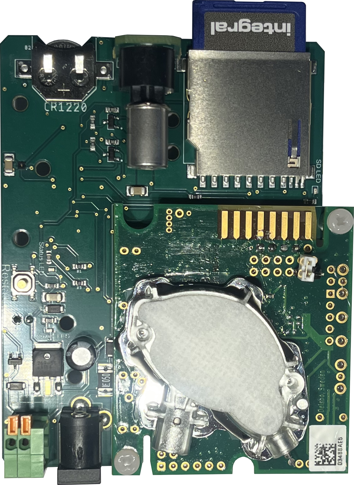

# CH<sub>4</sub> and CO<sub>2</sub> DIY sensor with automated aeration

This repository is dedicated to CH<sub>4</sub> and CO<sub>2</sub> sensors created by Jonas Stage Sø [(Sø et al., 2024)](https://doi.org/10.1029/2024JG008035) and [(Sø et al., 2023)](https://doi.org/10.1016/j.scitotenv.2023.162895).  
Sensors are made following [Bastviken et al. (2020)](https://doi.org/10.5194/bg-17-3659-2020), modified for automated fluxes, higher resolution, and lower power consumption by Jonas Stage Sø, University of Southern Denmark, Denmark.

## Repository structure

```
├── firmware/          Arduino sketches (normal run, no-pump, calibration, RTC setup)
├── hardware/          PCB files (Gerber, BOM, CPL, equipment list) and 3D-print STL
├── libraries/         Required Arduino libraries with install instructions
├── validation/        Sensor comparison data vs. Los Gatos Research instrument
├── docs/              Images and diagrams
├── archive/           Previous versions (v1, v2, v3, swimmer variant)
└── CHANGELOG.md       Version history
```

## Table of contents

* [Latest version](#latest-version)
* [Step-by-step guide](#a-step-by-step-guide-to-building-methane-and-co2-sensors-and-an-automated-floating-chamber)
  * [Building the sensor](#building-the-sensor)
  * [Building the chamber](#building-the-chamber)
* [Calibrating the CO<sub>2</sub> sensor](#calibrating-the-co2-sensor)

---

## Latest version

Version 4 brings several upgrades:

* The Arduino and datalogging shield from Version 3 are now integrated into a single PCB — fewer parts, lower cost.
* Switched from the NGM2611-E13 to the **Figaro TGS2611-E00** methane sensor. The TGS2611-E00 uses the SR-6 socket so the sensor can be replaced without soldering. Align the notch on the sensor with the footprint on the PCB. The methane sensor section have be broken off the PCB and soldered back to reduce overall height.
* Requires the **[MiniCore](https://github.com/MCUdude/MiniCore)** board package and a **USBASP ISP** programmer for uploading sketches.
* Three status LEDs:
  * **Power LED** — on whenever the sensor is powered
  * **SD LED** — blinks on every SD card write
  * **Status LED** — continuous light indicates an error (SD card, CO₂ sensor, SHT sensor, or ADC); blinks every 3 samples (6 s) when operating normally

---

## A step-by-step guide to building methane and CO<sub>2</sub> sensors and an automated floating chamber

> [!NOTE]
> Find all of this a bit too technical? Reach out to me and we can talk about collaborative possibilities at Jonassoe@biology.sdu.dk.

### Building the sensor

1. Buy all items from the [equipment list](hardware/pcb/equipment_list.md). Order the PCB from [JLCPCB](https://jlcpcb.com/) by uploading [`hardware/pcb/gerber.zip`](hardware/pcb/gerber.zip) and enabling PCB assembly with [`hardware/pcb/bom.csv`](hardware/pcb/bom.csv) and [`hardware/pcb/cpl.csv`](hardware/pcb/cpl.csv). A soldering iron, flux pen, solder wire, and solder wick are also needed.
2. Solder four pin headers to the K33 ELG CO<sub>2</sub> sensor so the pins and screws align with the PCB footprint.
3. Install the coin-cell battery (CR1220) to power the real-time clock (RTC).
4. Insert the SD card.

### Flashing the code onto the sensor 

#### Using the SensorUploader.jar file 
1. Download and install the [Java Delevopment Kit](https://www.oracle.com/au/java/technologies/downloads/). Remember to select the correct operating system before downloading.
2. Download the [SensorUploader program](firmware/SensorUploader%20program).
3. Open the file using Java.
4. Now install the prerequisites by pressing the button **Install Prerequisites**
5. If running on a windows computer, you might be directed the Zadig website. This is because your computer is missing the Libusb-win32 driver. This driver is pre-installed on Mac and Linux.
6. Install Zadig.
7. Run Zadig to install the driver as shown. <br><br>
8. After the driver installation is done, return to the SensorUploader program and run the **Install Prerequisites** again to be sure all is correct.
9. Set the **Measurement duration** and **Flushing duration**
10. Press **Upload to Sensor**. This will take some time, and you might get a couple of warnings and errors, but hopefully the status bar should indicate that all went as planned. 

#### Using the Arduino IDE
1. Download and install the [Arduino IDE](https://www.arduino.cc/en/software).
2. Install all required [libraries](libraries/README.md).
3. Install MiniCore following the [instructions here](https://github.com/MCUdude/MiniCore?tab=readme-ov-file#how-to-install).
4. Connect the sensor to your computer via the USBASP ISP.
5. In the Arduino IDE, go to **Tools → Board → MiniCore → ATmega328** and set the options to match: <br><br>
6. Press **Burn Bootloader**
7. Now upload [`firmware/rtc_setup/RTC_set.ino`](firmware/rtc_setup/RTC_set.ino) first to synchronise the RTC with your computer clock by going to **Sketch → Upload Using Programmer**.
8. Then upload the desired sketch from [`firmware/`](firmware/) in the same way **Sketch → Upload Using Programmer**:
    * [`firmware/normal_run/Normal_run_code.ino`](firmware/normal_run/Normal_run_code.ino) — standard deployment (40 min measure / 20 min vent cycle)
    * [`firmware/no_pump/No_pump_code.ino`](firmware/no_pump/No_pump_code.ino) — continuous logging without pump
    * [`firmware/calibration/Calibration_code.ino`](firmware/calibration/Calibration_code.ino) — continuous run for calibration
9. The sensor is now running. Note: the K33 CO<sub>2</sub> sensor requires at least 9 V — it will not respond when powered only through the USBASP ISP.
10. To read data, power off the sensor and open `datalog.csv` from the SD card.
11. For field deployment, connect a 12 V battery using a two-conductor wire. Observe correct polarity.

> [!WARNING]
> All Figaro CH₄ sensors must be calibrated to obtain the correct calibration coefficient. See [(Sø et al., 2024)](https://doi.org/10.1029/2024JG008035) for details.

### Building the chamber

* A 13.5 L bucket with a surface area of 0.0615 m² has been used. Adjust dimensions carefully — the sensor must not contact water.
* Wrap the outside of the bucket in aluminium foil tape to increase reflectance.
* Drill two holes on each side of the bucket at ~¾ of the depth from the top.
* Use two storage boxes (one inside, one outside the bucket). Drill aligned holes through both boxes and the bucket wall. Mount with screws, bolts, and an O-ring to prevent air exchange.
* Drill a small hole for fan wires and seal with silicone.
* Place the fan in the outer storage box and the sensor in the inner box. Connect the fan, observing polarity.
* Cut a 3 cm styrofoam sheet large enough to support the bucket, with a hole in the centre for the bucket. Attach with cable ties through holes drilled at the top of the bucket.
* The 3D-printed pump nozzle ([`hardware/3d_prints/pump_nozzle.stl`](hardware/3d_prints/pump_nozzle.stl)) connects the air pump outlet to the flexible tubing.



---

## Calibrating the CO<sub>2</sub> sensor

The K33 ELG CO<sub>2</sub> sensor can be calibrated to 400 or 0 ppm by shorting two pins on the sensor. For details, see the [SenseAir K33 ELG product page](https://senseair.com/product/k33-elg/).

---

## Previous versions

Older hardware and firmware is preserved in [`archive/`](archive/):

| Folder | Description |
|--------|-------------|
| [`archive/v1/`](archive/v1/) | Version 1 — initial Arduino shield design |
| [`archive/v2/`](archive/v2/) | Version 2 — higher-bit ADC resolution |
| [`archive/v3/`](archive/v3/) | Version 3 — SHT sensor, separate Arduino + datalogging shield |
| [`archive/swimmer/`](archive/swimmer/) | Experimental swimmer-mounted variant |

See [CHANGELOG.md](CHANGELOG.md) for a summary of changes between versions.
