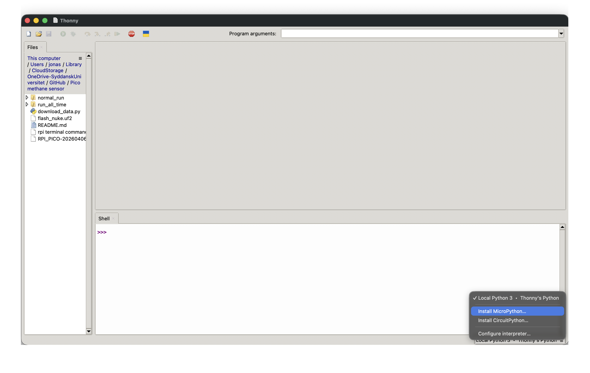
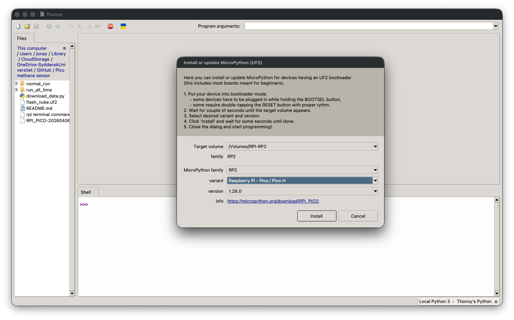
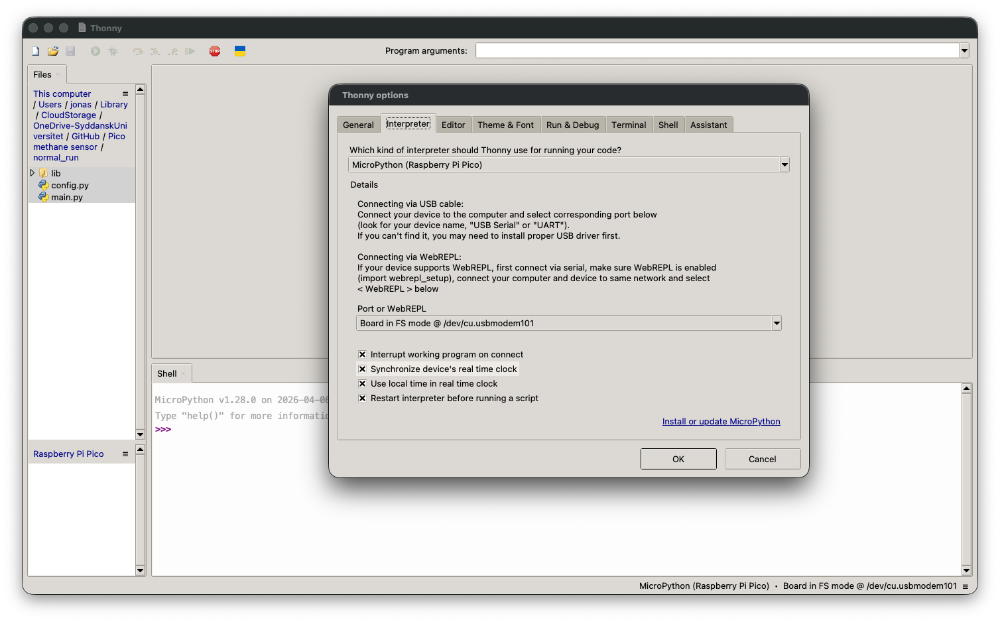
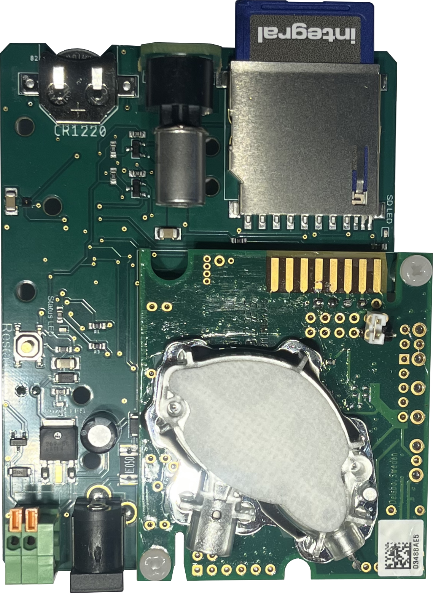

# CH<sub>4</sub> and CO<sub>2</sub> DIY sensor with automated aeration

This repository is dedicated to CH<sub>4</sub> and CO<sub>2</sub> sensors created by Jonas Stage Sø, for more information see [(Sø et al., 2024)](https://doi.org/10.1029/2024JG008035) and [(Sø et al., 2023)](https://doi.org/10.1016/j.scitotenv.2023.162895).  
Sensors are made following [Bastviken et al. (2020)](https://doi.org/10.5194/bg-17-3659-2020), modified for automated fluxes, higher resolution, and lower power consumption by Jonas Stage Sø, University of Southern Denmark, Denmark.

## Repository structure

```
├── firmware/          Arduino sketches (normal run, no-pump, calibration, RTC setup)
├── hardware/          PCB files (Gerber, BOM, CPL, equipment list) and 3D-print STL
├── validation/        Sensor comparison data vs. Los Gatos Research instrument
├── docs/              Images and diagrams
└── CHANGELOG.md       Version history
```

## Table of contents

* [Latest version](#latest-version)
  * [Previous versions](#previous-versions)
* [Step-by-step guide](#a-step-by-step-guide-to-building-methane-and-co2-sensors-and-an-automated-floating-chamber)
  * [Ordering the PCB](#ordering-the-pcb)
  * [Building the sensor](#building-the-sensor)
  * [Flashing the code to the sensor](#flashing-the-code-to-the-sensor)
  * [Building the chamber](#building-the-chamber)
* [Calibrating the CO<sub>2</sub> sensor](#calibrating-the-co2-sensor)

---

## Latest version
Version 3 changes the backbone of the sensor:

* I've move away from the ATMEGA family, now the sensor is build around a RP2040 instead.
* The new RP2040 makes it easy to connect through USB-C, allowing to upload code and readout serial output through it.
* Even better resolution of the methane sensor, as the adc is now using differential input.
* Even fewer soldering points! Only 12 points needs to be soldered now.
* Minor improvements to layout and design.

### Previous versions
Version 2 brings several upgrades:

* The Arduino and datalogging shield from Version 3 are now integrated into a single PCB — fewer parts, lower cost.
* Switched from the NGM2611-E13 to the **Figaro TGS2611-E00** methane sensor. The TGS2611-E00 uses the SR-6 socket so the sensor can be replaced without soldering. Align the notch on the sensor with the footprint on the PCB. The methane sensor section have be broken off the PCB and soldered back to reduce overall height.
* Requires the **[MiniCore](https://github.com/MCUdude/MiniCore)** board package and a **USBASP ISP** programmer for uploading sketches.
* Three status LEDs:
  * **Power LED** — on whenever the sensor is powered
  * **SD LED** — blinks on every SD card write
  * **Status LED** — continuous light indicates an error (SD card, CO₂ sensor, SHT sensor, or ADC); blinks every 3 samples (6 s) when operating normally

See [CHANGELOG.md](CHANGELOG.md) for a summary of changes between versions.

---

## A step-by-step guide to building methane and CO<sub>2</sub> sensors and an automated floating chamber

> [!NOTE]
> Find all of this a bit too technical? Reach out to me and we can talk about collaborative possibilities at Jonassoe@biology.sdu.dk.

### Ordering the PCB 
A video of how to order the PCB (printed curcuit board) can be found here. Minor changes have been made to the gerber file since I created the video. 
Visit [JLCPCB](https://jlcpcb.com/) to order the PCB, this is done by uploading [`hardware/pcb/gerber.zip`](hardware/pcb/gerber.zip) and enabling PCB assembly with [`hardware/pcb/bom.csv`](hardware/pcb/bom.csv) and [`hardware/pcb/cpl.csv`](hardware/pcb/cpl.csv).<br><br>
[](https://www.youtube.com/watch?v=w76-FkEEgp0)

### Building the sensor

1. Buy all items from the [equipment list](hardware/pcb/equipment_list.md). A soldering iron, flux pen, solder wire, and solder wick are also needed.
2. Solder four pin headers to the K33 ELG CO<sub>2</sub> sensor so the pins and screws align with the PCB footprint.
3. Install the coin-cell battery (CR1220) to power the real-time clock (RTC).
4. Insert the SD card (FAT32 format).
5. Now the sensor is ready to be flashed! 

### Flashing the code to the sensor 

1. Download and install [Thonny](https://thonny.org).
2. Connect the sensor to your computer via a USB-C cable. You should see the sensor show up as a hard drive on your computer.
3. Install MicroPython on the sensor. This can be done through Thonny or by drag-and-dropping the .uf2 file found [here](https://micropython.org/download/rp2-pico/rp2-pico-latest.uf2) onto the sensor drive.
  * To install MicroPython through Thonny follow these steps:
    * In the bottom right corner press the text to open up the menu. <br>
    * Select the options as shown here. Currently the newest version is 1.28.0, but newer versions should also work. <br>
    * Install MicroPython by pressing 'Install'
4. The sensor will reboot, and you might have to press the 'Stop' button at the top to reconnect to it. 
5. If you haven't been using Thonny, now you have to. 
6. Ensure that 'Synchronize device's real time clock' is ticked in the settings menu. <br>
7. A new window will appear in the bottom left corner, with the title Raspberry Pi Pico.
8. Within Thonny locate the folder with the code you wish to upload. Usually it would be the [normal_run](firmware/normal_run/) code. 
9. Mark all the files in the folder 'Main.py', 'Config.py' and the 'lib' folder. 
10. Right click and choose 'Upload to /'.
11. The sensor will now automatically start when the sensor is powered on or you can run the program by opening the main.py and pressing the green arrow.
12. The sensor is now running. Note: the K33 CO<sub>2</sub> sensor requires at least 9 V — it will not respond when powered only through the USBASP ISP.
13. To read data, power off the sensor and open `datalog.csv` from the SD card.
14. For field deployment, connect a 12 V battery using a two-conductor wire. Observe correct polarity.

> [!WARNING]
> All Figaro CH₄ sensors must be calibrated to obtain the correct calibration coefficient. See [(Sø et al., 2024)](https://doi.org/10.1029/2024JG008035) for details.

### Building the chamber

* A 13.5 L bucket with a surface area of 0.0615 m² has been used. Adjust dimensions carefully — the sensor must not contact water.
* Wrap the outside of the bucket in aluminium foil tape to increase reflectance.
* Drill two holes on each side of the bucket at ~¾ of the depth from the top.
* Use two storage boxes (one inside, one outside the bucket). Drill aligned holes through both boxes and the bucket wall. Mount with screws, bolts, and an O-ring to prevent air exchange.
* Drill a small hole for fan wires and seal with silicone.
* Place the fan in the outer storage box and the sensor in the inner box. Connect the fan, observing polarity.
* Cut a 3 cm styrofoam sheet large enough to support the bucket, with a hole in the centre for the bucket. Attach with cable ties through holes drilled at the top of the bucket.
* The 3D-printed pump nozzle ([`hardware/3d_prints/pump_nozzle.stl`](hardware/3d_prints/pump_nozzle.stl)) connects the air pump outlet to the flexible tubing.



---

## Calibrating the CO<sub>2</sub> sensor

The K33 ELG CO<sub>2</sub> sensor can be calibrated to 400 or 0 ppm by shorting two pins on the sensor. For details, see the [SenseAir K33 ELG product page](https://senseair.com/product/k33-elg/).
