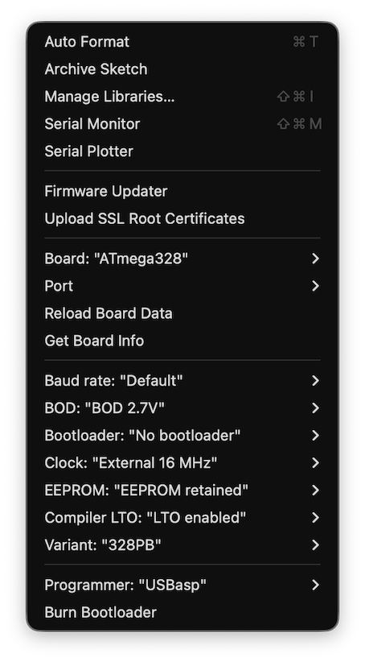

# Firmware

Arduino sketches for the CH₄ and CO₂ sensor (Version 4).

> **Before uploading any sketch**, first run `rtc_setup/RTC_set.ino` once to synchronise the real-time clock with your computer.

| Folder | Sketch | Use |
|--------|--------|-----|
| `normal_run/` | `Normal_run_code.ino` | Standard deployment — measures for 40 min, vents chamber for 20 min, repeats |
| `no_pump/` | `No_pump_code.ino` | Continuous logging without activating the pump |
| `calibration/` | `Calibration_code.ino` | Continuous run for sensor calibration; CO₂ not logged to save power |
| `rtc_setup/` | `RTC_set.ino` | Sets the RTC to match the computer clock — upload once before deployment |

## Required libraries

Install all libraries listed in [`libraries/README.md`](../libraries/README.md) before compiling.

## Board setup (MiniCore)

1. Install [MiniCore](https://github.com/MCUdude/MiniCore?tab=readme-ov-file#how-to-install) in the Arduino IDE.
2. Connect the sensor via a USBASP ISP programmer.
3. Under **Tools → Board → MiniCore → ATmega328**, set options to match:

